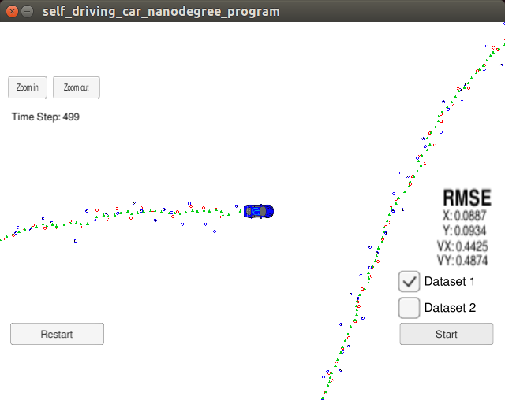

# CarND-Extended-Kalman-Filter-Project
Self-Driving Car Engineer Nanodegree Program

---

## Implementation

The EKF implementation is similar to the one introduced in class. The state vector is `[x, y, vx, vy]` and the measurement vector is `[x, y]` for laser and `[ro, theta, ro_dot]` for radar.

Dimensions for all the matrices are:
```
F = 4x4
R_laser = 2x2
R_radar = 3x3
H_laser = 2x4
H_radar = 3x4
Q = 4x4
```

`FusionEKF::ProcessMeasurement()` is the main processing function which gets called repeatedly everytime a new measurement is received. It performs the following steps:
1. Initialize the EKF is not already initialized.
2. Perform prediction step using motion model.
3. Perform update step using measurement data.
4. Update timestamp.

Initialization is achieved by `KalmanFilter::Init()` function. It basically initialize the state vector with the first received measurement.

`KalmanFilter::Predict()` implements the prediction step. It uses constant velocity model and assumes acceleration is a random noise (described by Q matrix).

There are two update functions. For laser measurement, since its measurement model is linear, we can use the classic Kalman filter update function `KalmanFilter::Update()`. For radar measurement, however, the measurement model is nonlinear, thus we have to use the EKF update equations (`KalmanFilter::UpdateEKF()`). Most importantly, we need to compute the **Jacobian** of H matrix at current x. The Jacobian is computed by `Tools::CalculateJacobian()` function. The derivative chain rule is employed during the derivation.

In the main function, I use `Tools::CalculateRMSE()` to compute RMSE. I used `Eigen` library to help with RMSE calculation.

## Caveats

1. During initial testing, my EKF very quickly diverges and results it very large errors. It turns out that I did not compute the delta_t correctly. In the input data, the timestamp is an integer of unit `us`. Therefore, I need to convert it to canonical seconds before doing any other computation. After the conversion, the EKF tracks well mostly.

2. During the tracking, there is one specific location where a very large error is observed. It happens right around `y==0 and x<0` and it is quite repeatable. When `y==0 and x<0`, the bearing angle `theta` is actually very unstable. It could fluctuate between +pi and -pi depending on the sign of y. It means that it is necessary to normalize any angle deltas. For example, when computing innovation `y = z - z_`, the middle element is theta. We must normalize it back to `[-pi, +pi]`. Otherwise large errors will occur at the point around `y==0 and x<0`.


## Screenshots



